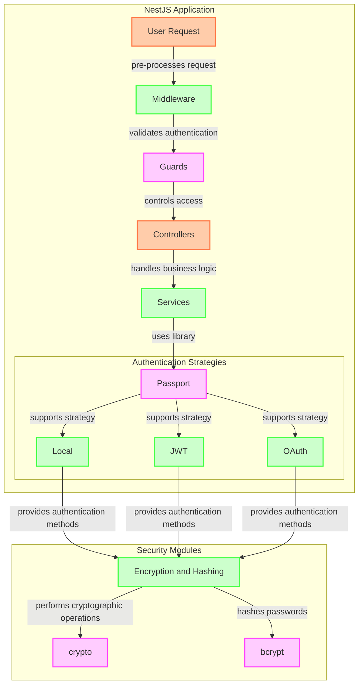
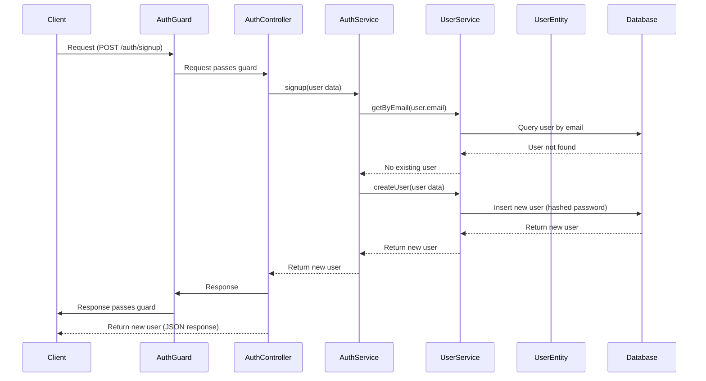
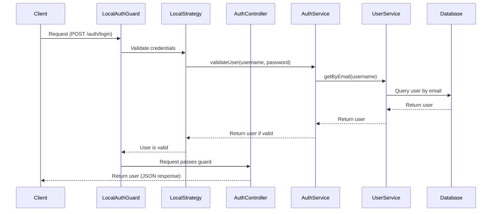
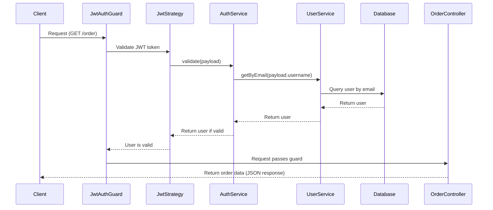
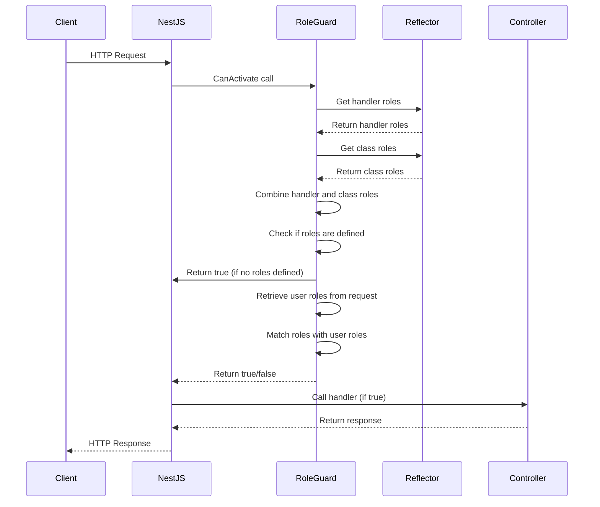
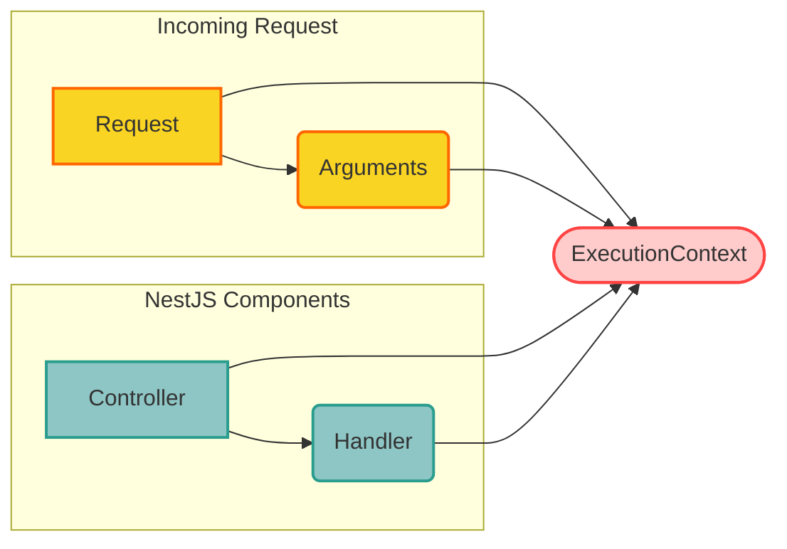
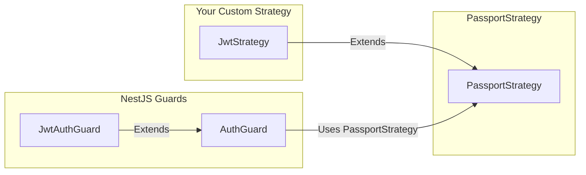
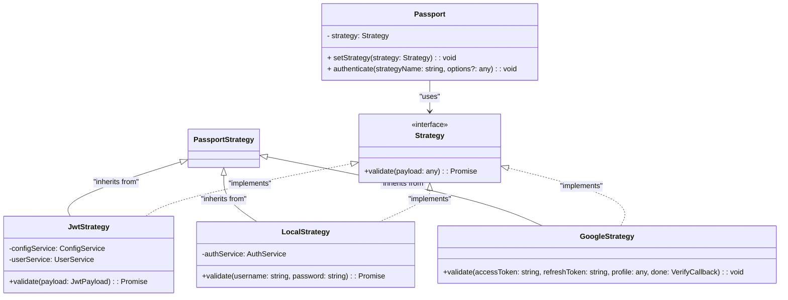

# NestJS Authentication

# Overview

## Sign Up Flow

## Login Flow

## Order Retrieval Flow

## Role Guards

## Execution Context

Key Methods in ExecutionContext:

- `switchToHttp()`: Access the underlying HTTP request and response objects (if applicable).
- `getClass()`: Get the class of the controller handling the request.
- `getHandler()`: Get the specific handler method being executed.
- `getArgs()`: Get the arguments passed to the handler.

## JWT Guard

### JWT Strategy

